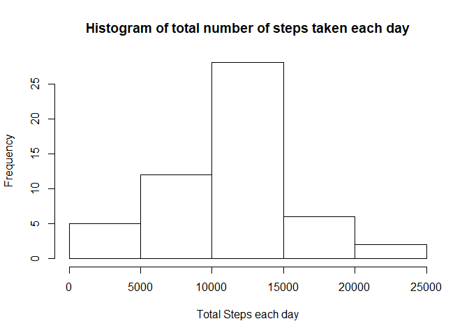
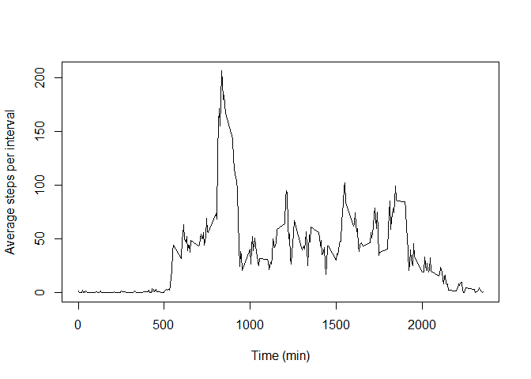
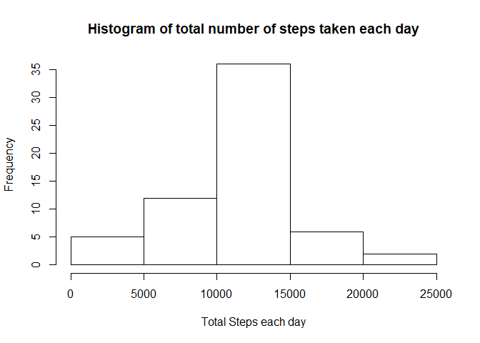
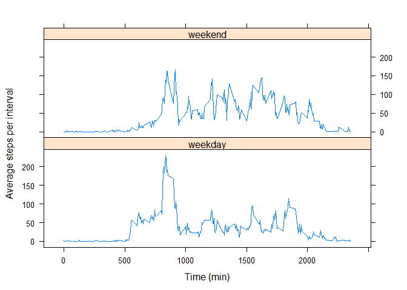

## Loading and preprocessing the data
Assuming the file is in the current working directory, we retrieve the file after
from "activity.zip". Then, we change the second column to a proper Data datatype.

```r
df <- read.csv(unzip(zipfile = "activity.zip", files = "activity.csv"))
df$date <- as.Date(df$date, format = "%Y-%m-%d")
```


## What is mean total number of steps taken per day?
Ignoring the missing values for steps,

```r
df.steps <- df[!is.na(df$steps),]
```

we construct a histogram for *total* steps each day.

```r
library(dplyr)

df.tot.steps <- group_by(df.steps, date)
df.tot.steps <- summarise(df.tot.steps, tot.steps = sum(steps))
hist(df.tot.steps$tot.steps, main = "Histogram of total number of steps taken each day", xlab = "Total Steps each day")
```

<!-- -->

The mean total steps taken per day is,

```r
mean(df.tot.steps$tot.steps)
```

```
## [1] 10766.19
```

The median total steps taken per day is,

```r
median(df.tot.steps$tot.steps)
```

```
## [1] 10765
```

## What is the average daily activity pattern?
We first average activity across all day,

```r
library(dplyr)

df.avg.steps <- group_by(df.steps, interval)
df.avg.steps <- summarise(df.avg.steps, avg.steps = mean(steps))
```

We now construct a time series plot,

```r
plot(df.avg.steps$interval, df.avg.steps$avg.steps, type = "l",
     xlab = "Time (min)", ylab = "Average steps per interval")
```

<!-- -->

The interval with highest average step count is from,

```r
interval <- df.avg.steps[df.avg.steps$avg.steps == max(df.avg.steps$avg.steps),]$interval
interval
```

```
## [1] 835
```

to, 840.

## Imputing missing values
The total number of rows with NAs is,

```r
sum(!complete.cases(df))
```

```
## [1] 2304
```

Note: the missing values are only located in the steps column.
This R code counts how many incomplete cases there are in either the date or 
interval columns. A value of 0 demonstrates no NAs in either column.

```r
sum(!complete.cases(df[, c("date", "interval")]))
```

```
## [1] 0
```

We could fill these values with the mean for each interval.

```r
df.na <- df[is.na(df$steps),]
avg.steps <- t(df.avg.steps$avg.steps)
colnames(avg.steps) <- t(df.avg.steps$interval)
df.na$steps <- avg.steps[,as.character(df.na$interval)]
df.filled <- rbind(df.steps, df.na)
```

Running the first part of the assignment over this imputed dataset
we get the following.
We construct a histogram for *total* steps each day.

```r
library(dplyr)

df.tot.fill <- group_by(df.filled, date)
df.tot.fill <- summarise(df.tot.fill, tot.steps = sum(steps))
hist(df.tot.fill$tot.steps, main = "Histogram of total number of steps taken each day", xlab = "Total Steps each day")
```

<!-- -->

The mean total steps taken per day is,

```r
mean(df.tot.fill$tot.steps)
```

```
## [1] 10766.19
```

The median total steps taken per day is,

```r
median(df.tot.fill$tot.steps)
```

```
## [1] 10766.19
```

Imputing the values produced a histrogram that has less spread. This is because
we used the mean to replace the values giving the mean a stronger signal.
The mean was unchanged for the same reasons.  
The median became equal to the mean as the mean had a larger signal in the data.

## Are there differences in activity patterns between weekdays and weekends?
Construct new column for weekday or weekend.

```r
df.weekday <- weekdays(df.filled$date)
df.filled$weekday <- ifelse(grepl("(Saturday|Sunday)", df.weekday),
                            "weekend", "weekday")
```

We plot the average intervals for both factor to compare.

```r
library(dplyr)
library(lattice)

df.weekday <- group_by(df.filled, interval, weekday)
df.weekday <- summarise(df.weekday, avg.steps = mean(steps))
xyplot(avg.steps~interval|weekday, df.weekday, type = "l", layout = c(1,2),
       xlab = "Time (min)", ylab = "Average steps per interval")
```

<!-- -->
